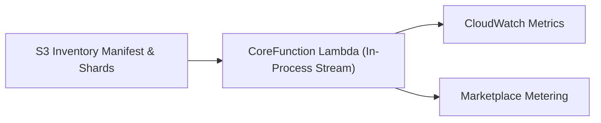
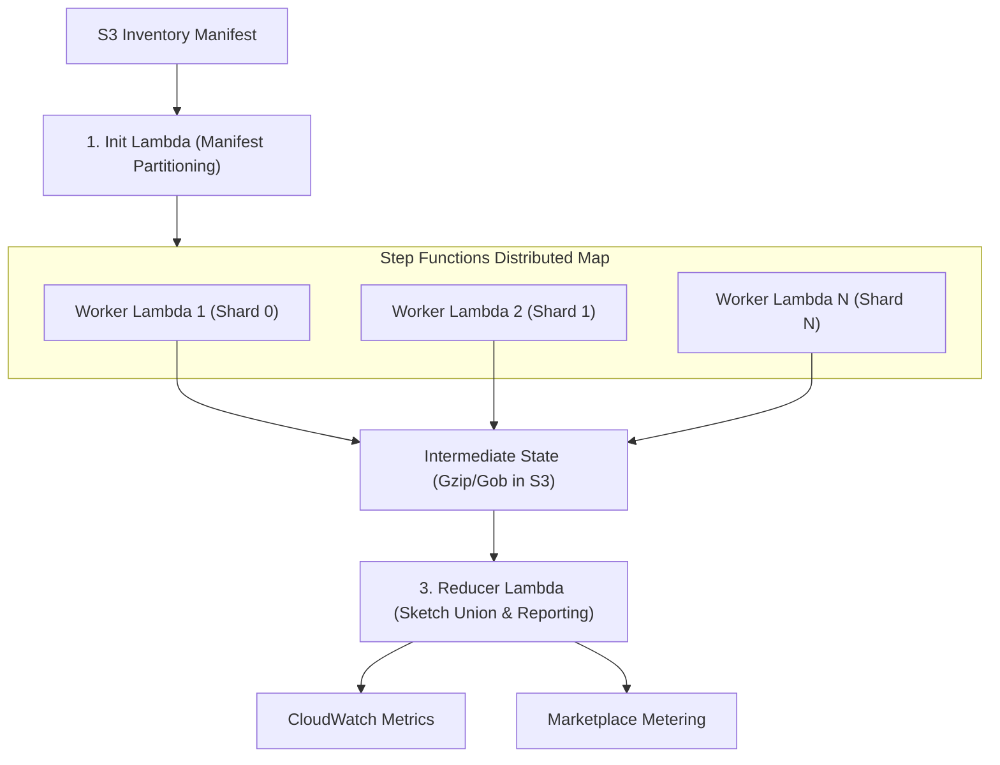

# Execution Modes

While deployment methods (such as Autopilot, Standard, and Multi-Region) define *how and where* infrastructure is provisioned, **Execution Modes** define the *runtime compute engine* used to process S3 inventory reports.

`s3lim` supports two operational execution modes to accommodate S3 inventories ranging from small single-bucket repositories to multi-billion object enterprise data lakes. Both modes are supported across all deployment templates (`data-plane-template.yaml` and `data-plane-stackset.yaml`) and are configured via the `ExecutionMode` parameter.

---

## Comparison Matrix

| Attribute | Fast Mode *(Default)* | Distributed Mode |
| :--- | :--- | :--- |
| **Target Scale** | ≤ 100 million objects | Multi-billion objects (1,000+ shards) |
| **Architecture** | Single in-process `CoreFunction` Lambda | AWS Step Functions Distributed Map |
| **Execution Steps** | Direct stream scan in Lambda memory | `Init` → `Worker × N` → `Reducer` |
| **Concurrency** | 1 (sequential shard processing) | 100 workers (configurable 1–500 via `WorkerMaxConcurrency`) |
| **Intermediate State** | None (100% in-memory) | Gzip/Gob partial sketches in S3 (`.s3lim-intermediate/`) |
| **Auto-Cleanup** | N/A | 7-day S3 Bucket Lifecycle Expiration rule |
| **Timeout Boundary** | 15 minutes (single Lambda execution limit) | None (Step Functions coordinates distributed tasks) |
| **Additional AWS Resources** | None | Step Functions State Machine, IAM execution role |

---

## Fast Mode (Default)

`ExecutionMode: Fast` is optimized for speed, simplicity, and low operational overhead. It executes the entire inventory parsing, sketch generation, and metric publication within a single AWS Lambda invocation without deploying state machines or writing intermediate state to S3.



### Built-in Limit Protections

Fast Mode includes safety mechanisms that continuously monitor execution metrics and emit structured alerts before limits are reached—without interrupting the scan:

1. **Pre-Scan Shard & Size Warning**:
   Before reading inventory data, the Lambda inspects the manifest metadata. If the inventory contains **>100 shards** or **>5 GB of compressed data**, a structured `WARN` log is emitted recommending migration to Distributed Mode.

2. **100M Object Milestone**:
   As objects are ingested, `s3lim` logs an operational milestone at **100,000,000 scanned objects**, providing visibility into throughput and memory efficiency.

3. **Pre-Timeout Diagnostic Warning**:
   The Lambda monitors its context deadline. If the scan is still running **90 seconds before the 15-minute Lambda timeout**, `s3lim` logs an actionable `ERROR` detailing the current shard progress, processed key count, and elapsed runtime.

4. **Billing Safety**:
   AWS Marketplace metering records are emitted **strictly after a 100% complete and verified scan report**. Incomplete or timed-out scans never bill the customer.

---

## Distributed Mode

`ExecutionMode: Distributed` orchestrates analysis across an **AWS Step Functions Distributed Map**, fanning out Worker Lambdas concurrently across inventory data shards. This architecture eliminates Lambda timeout limits and scales horizontally across multi-terabyte manifests.



### Execution Lifecycle

1. **Init Lambda**:
   Downloads the inventory manifest (`manifest.json`), parses the list of data file shards, creates a unique job identifier (`job-id`), and returns the partitioned shard payloads.

2. **Worker Lambdas (Distributed Map)**:
   The Step Functions Distributed Map spawns concurrent Worker Lambda invocations up to the configured `WorkerMaxConcurrency`. Each Worker:
   * Downloads and streams its assigned inventory data shard (CSV, Parquet, or ORC).
   * Populates independent probabilistic sketches across all 18 aggregators (Top-K, HyperLogLog, Histograms, etc.).
   * Serializes its aggregator state via Gzip-compressed Go `encoding/gob` binary stream.
   * Uploads the serialized state to `s3://<InventoryBucket>/.s3lim-intermediate/<job-id>/<shard-id>.gz`.

3. **Reducer Lambda**:
   Once all Worker Lambdas complete successfully:
   * Streams and deserializes all intermediate shard files from S3.
   * Merges and unions sketches across all aggregators with zero information loss.
   * Publishes final custom metrics to Amazon CloudWatch.
   * Emits the AWS Marketplace volume metering record.
   * Triggers background cleanup of the intermediate S3 job directory.

---

## When to Use Distributed Mode

| Trigger Indicator | Fast Mode | Distributed Mode |
| :--- | :--- | :--- |
| **Object Count** | < 100M objects | ≥ 100M objects |
| **Shard Count** | 1–100 shards | > 100 shards |
| **Manifest Data Volume** | < 5 GB compressed | ≥ 5 GB compressed |
| **Scan Execution Time** | < 10 minutes | Approaches 15-minute Lambda limit |

> [!TIP]
> **In-Place Migration**: You can switch an active deployment between `Fast` and `Distributed` at any time by updating the CloudFormation stack parameter `ExecutionMode`. No data or infrastructure redeployment is necessary.

---

## IAM Policy Requirements (BYO-IAM)

When deploying with a custom pre-audited IAM role (`LambdaRoleArn`) in **Distributed Mode**, ensure the role includes permissions for intermediate S3 storage and Step Functions execution in addition to standard read permissions:

```json
{
  "Version": "2012-10-17",
  "Statement": [
    {
      "Sid": "DistributedIntermediateStateAccess",
      "Effect": "Allow",
      "Action": [
        "s3:PutObject",
        "s3:GetObject",
        "s3:DeleteObject",
        "s3:DeleteObjectVersion"
      ],
      "Resource": "arn:aws:s3:::<your-inventory-bucket>/.s3lim-intermediate/*"
    },
    {
      "Sid": "StepFunctionsExecution",
      "Effect": "Allow",
      "Action": [
        "states:StartExecution",
        "states:DescribeExecution",
        "states:GetExecutionHistory"
      ],
      "Resource": "arn:aws:states:*:*:stateMachine:s3lim-*"
    }
  ]
}
```

*Note: For standard Managed IAM deployments (where `LambdaRoleArn` is omitted), these permissions and the Step Functions execution role are automatically provisioned with least-privilege scoping.*

---

## Performance & Metric Equivalence

Both Fast Mode and Distributed Mode utilize identical mathematical sketch data structures (Count-Min Sketches, Space-Saving Top-K, and HyperLogLog counters), guaranteeing full metric equivalence:

* **100% Metric Equivalence**: Distributed sketch union yields identical counts, duplicate rates, size histograms, and top prefix rankings as single-process Fast Mode.
* **Horizontal Scalability**: On multi-shard benchmarks (e.g. ESA Sentinel-2 L1C dataset of 19.17M objects across 10 shards), Distributed Mode achieves over **3.0x speedup** on 8 workers compared to sequential execution, reducing analysis time from ~49 seconds to ~16 seconds.
